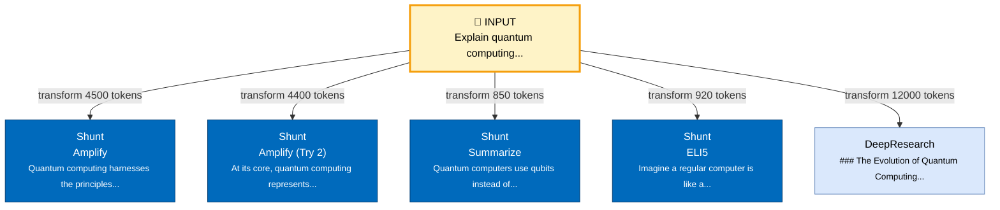

# Workflow Tracking System - Implementation Guide

## Overview

This system automatically tracks and visualizes **transformation experiments** - when you send the same input through multiple components or the same component multiple times to compare different AI-generated outputs.

**Example Use Case:**
```
Your Input: "Research autonomous development frameworks"

├─> Shunt (Amplify) Try 1 → Output A
├─> Shunt (Amplify) Try 2 → Output B (different!)
├─> Shunt (Summarize) → Output C
└─> DeepResearch → Output D
```

The system detects that all 4 transformations used the SAME input and automatically groups them for comparison.

---

## What Was Built

### 1. ContentFlowTracker Service
**File:** `/services/contentFlowTracker.ts`

**Key Features:**
- Automatically detects when the same input is reused
- Tracks attempt numbers for repeated transformations
- Groups transformations by input for easy comparison
- Exports/imports history for persistence

**Core Method:**
```typescript
contentFlowTracker.recordTransformation(
  componentName: "Shunt",
  input: "Your prompt here",
  output: "AI generated output",
  metadata: {
    actionName: "Amplify",
    tokenUsage: 1500,
    modelUsed: "gemini-2.5-pro"
  }
);
```

### 2. Workflow Diagram Generator
**File:** `/services/diagramService.ts`

**Functions:**
- `generateWorkflowDiagram(session)` - Creates Mermaid flowchart showing:
  - Input nodes (yellow, bold)
  - Transformation branches (color-coded by component)
  - Attempt numbers for repeated transformations
  - Token usage on edges

- `generateTransformationComparisonTable(group)` - Creates markdown table comparing all transformations of the same input

---

## How to Integrate

### Step 1: Import the tracker

```typescript
import { contentFlowTracker } from '@/services/contentFlowTracker';
```

### Step 2: Record transformations after AI calls

**Example: In Shunt component (`components/shunt/Shunt.tsx`)**

```typescript
const handleShunt = async () => {
  // ... existing code ...

  // After getting AI response:
  const { resultText, tokenUsage } = await performShunt(
    inputText,
    selectedAction,
    selectedModel
  );

  // Record the transformation
  contentFlowTracker.recordTransformation(
    'Shunt',
    inputText,              // The input
    resultText,             // The AI output
    {
      actionName: selectedAction,  // e.g., "Amplify", "Summarize"
      tokenUsage: tokenUsage.total_tokens,
      modelUsed: selectedModel
    }
  );

  // ... rest of existing code ...
};
```

**Example: In Chat component**

```typescript
// After AI response
contentFlowTracker.recordTransformation(
  'Chat',
  userMessage,
  aiResponse,
  {
    tokenUsage: response.tokenUsage.total_tokens,
    modelUsed: 'gemini-2.5-flash'
  }
);
```

**Example: In Tool for AI**

```typescript
// After job execution
contentFlowTracker.recordTransformation(
  'Tool for AI',
  jobDescription,
  executionResult,
  {
    actionName: jobType,
    tokenUsage: result.tokenUsage
  }
);
```

---

## Visualization Example

### Input:
```
"Explain quantum computing"
```

### Transformations:
1. **Shunt (Amplify)** → 5,000 word detailed explanation
2. **Shunt (Amplify) Try 2** → Different 4,800 word explanation
3. **Shunt (Summarize)** → 200 word summary
4. **Shunt (ELI5)** → Simple explanation for kids
5. **DeepResearch** → 10,000 word research report

### Generated Mermaid Diagram:


---

## API Reference

### ContentFlowTracker

#### `recordTransformation(componentName, input, output, metadata?)`
Records a single transformation experiment.

**Returns:** `TransformationNode`

#### `buildWorkflowSession(sessionId)`
Builds a complete workflow session with all transformations grouped by input.

**Returns:** `WorkflowSession`

#### `groupByInput()`
Groups all transformations by their source input.

**Returns:** `TransformationGroup[]`

#### `getMostExperimentedInputs(limit?)`
Returns the inputs that have been transformed the most times.

**Returns:** `TransformationGroup[]`

#### `exportHistory()` / `importHistory(json)`
Persist transformation history to/from JSON.

---

## Next Steps

### 1. Create UI Component

Create `/components/workflow/WorkflowVisualizer.tsx`:

```tsx
import { useState, useEffect } from 'react';
import { contentFlowTracker } from '@/services/contentFlowTracker';
import { generateWorkflowDiagram } from '@/services/diagramService';

const WorkflowVisualizer = () => {
  const [mermaidCode, setMermaidCode] = useState('');
  const [session, setSession] = useState(null);

  useEffect(() => {
    const updateWorkflow = () => {
      const sessionData = contentFlowTracker.buildWorkflowSession('current');
      setSession(sessionData);
      setMermaidCode(generateWorkflowDiagram(sessionData));
    };

    // Update every 5 seconds
    const interval = setInterval(updateWorkflow, 5000);
    updateWorkflow(); // Initial load

    return () => clearInterval(interval);
  }, []);

  return (
    <div className="p-4">
      <h2>Transformation Experiments</h2>

      {/* Render Mermaid diagram */}
      <pre className="mermaid">{mermaidCode}</pre>

      {/* Export options */}
      <button onClick={() => downloadAsSVG(mermaidCode)}>
        Export as SVG
      </button>

      {/* Show most experimented inputs */}
      <div>
        <h3>Most Experimented Prompts</h3>
        {session?.transformationGroups
          .sort((a, b) => b.transformations.length - a.transformations.length)
          .slice(0, 5)
          .map(group => (
            <div key={group.inputHash}>
              <p>{group.inputPreview}</p>
              <p>{group.transformations.length} transformations</p>
            </div>
          ))}
      </div>
    </div>
  );
};
```

### 2. Add to Chronicle Tab

Option A: Add a "Workflow" button to Chronicle that shows the diagram

Option B: Create a new tab in MissionControl called "Workflow Lab"

### 3. Enable Persistence

Add to `App.tsx` or main component:

```typescript
// On app close, save history
window.addEventListener('beforeunload', () => {
  const history = contentFlowTracker.exportHistory();
  localStorage.setItem('workflow_history', history);
});

// On app load, restore history
useEffect(() => {
  const savedHistory = localStorage.getItem('workflow_history');
  if (savedHistory) {
    contentFlowTracker.importHistory(savedHistory);
  }
}, []);
```

---

## Benefits

1. **Compare AI Variance** - See how outputs differ when running the same prompt multiple times
2. **Optimize Workflows** - Discover which transformations work best for specific inputs
3. **Track Experiments** - Never lose track of which approach you tried
4. **Pattern Discovery** - AI can analyze your transformation patterns and suggest improvements
5. **Audit Trail** - Complete record of all AI transformations in your session

---

## Future Enhancements

1. **AI-Powered Analysis** - Use Gemini to analyze transformation groups and suggest best outputs
2. **A/B Testing** - Automatically run multiple transformations and compare quality scores
3. **Export to Draw.io** - Convert Mermaid diagrams to editable .drawio format
4. **Workflow Templates** - Save successful transformation patterns as reusable templates
5. **Chain Detection** - Detect when output of one transformation becomes input of another
